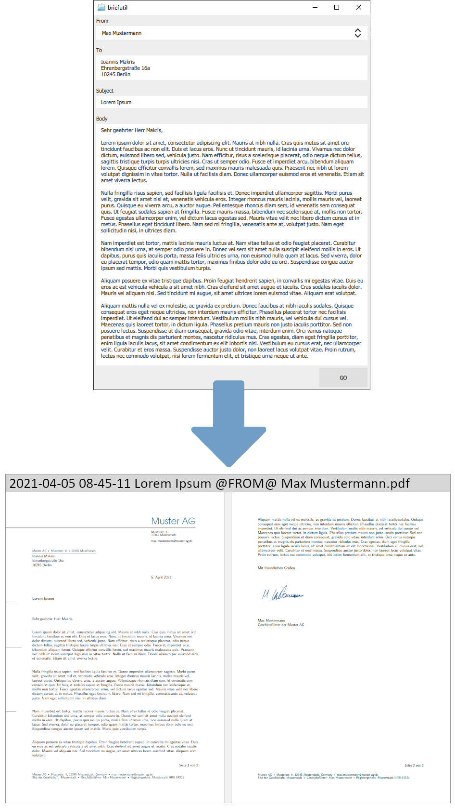
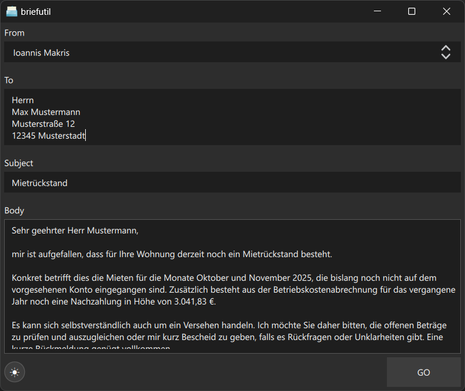

# briefutil

Small Qt Quick utility I use to turn ad-hoc letter text into nicely formatted PDFs via LaTeX. It is a personal tool built around my own workflow, shared in case someone else finds it useful.




## Repository layout
```
.
|- briefutil/         # Application sources, templates, and build files
|- example.png        # Screenshot used in the README
|- sample_screenshot.png
|- LICENSE.txt
\- README.md
```
The `briefutil` directory contains both the original qmake project (`briefutil.pro`) and the CMake build system.

## Build requirements
- CMake 3.16 or newer
- A C++17 compiler with `std::filesystem`
- Qt 5.15+ or Qt 6 with the Core, Gui, Qml, and Quick modules
- PowerShell (Windows) to expand archives

## Configure and build
```bash
cmake -S briefutil -B build -DCMAKE_PREFIX_PATH="C:/Qt/6.9.1/msvc2022_64"
cmake --build build --config Release
```
Adjust `CMAKE_PREFIX_PATH` to point at your local Qt installation. To bundle a portable MiKTeX runtime (downloads about 200 MB on first use):
```bash
cmake --build build --target portable_miktex --config Release
```
Skip that step or pass `-DBRIEFUTIL_BUNDLE_MIKTEX=OFF` if you prefer to rely on a system-wide MiKTeX installation.

## Install and package
```bash
cmake --install build --config Release --prefix C:/apps/briefutil
cpack -C Release --config build/CPackConfig.cmake
```

## Runtime notes
- On first launch the executable creates `~/briefutil/templates/` and populates it with anonymized "Max Mustermann" examples plus a synthetic signature image. Replace those files with your own stationery as needed.
- Output is written under `~/briefutil/output/` by default. Override via `output_dir.conf` if you prefer a different location.
- `texify.exe` is resolved from the bundled portable MiKTeX tree (`<install>/miktex/texmfs/install/miktex/bin/x64/texify.exe`) first, and then from `PATH`. Keep MiKTeX up to date if you rely on the bundled copy.
- Templates rely on standard LaTeX packages; adjust as you like, but the project is intentionally lightweight and tailored for a single-user workflow.

## License
Source code is provided under the Simplified BSD License (see `LICENSE.txt`). The included templates and signature use generic "Max Mustermann" placeholder data so that nothing personal is shipped with the repository.
