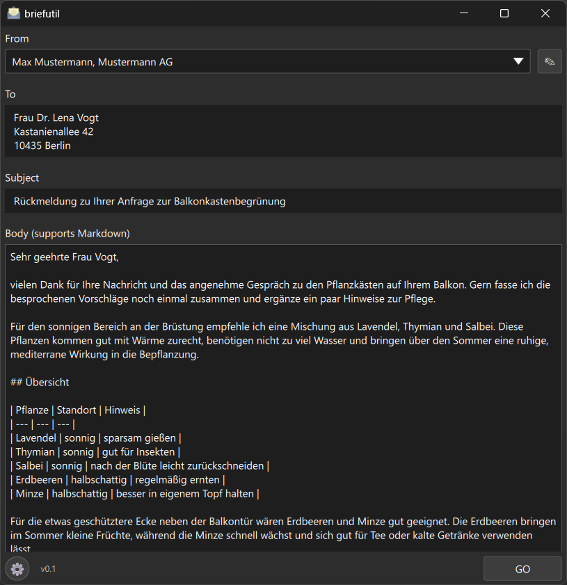
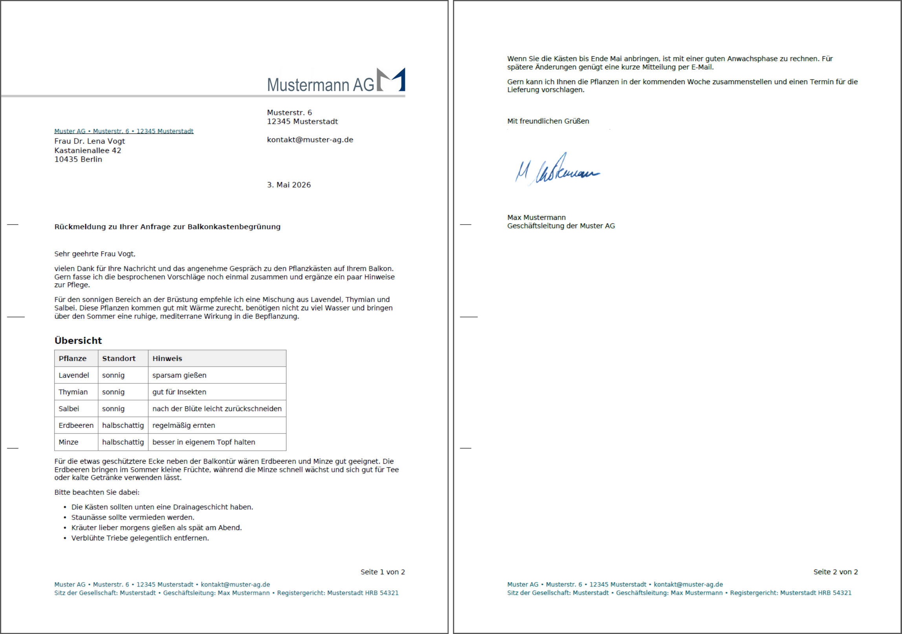

# briefutil

`briefutil` is a small utility for turning short letters into PDF files. It
ships as both a Qt Quick desktop app and a CLI.

Letter layout, markdown body parsing, and PDF rendering are handled natively in
C++ with Qt 6 and mark2haru.

<p align="center">
  
</p>

The letter above produces a PDF like this:

<p align="center">
  
</p>

## What it does

- lets you pick a sender profile from JSON files
- collects recipient, subject, and body text in a small desktop UI
- provides `briefutil_cli` for scriptable PDF generation
- supports Markdown in the letter body (asterisk and underscore variants)
- generates DIN 5008 form A/B and US Letter PDFs
- ships bundled TrueType fonts and can use explicit `.ttf` font files
  (TrueType rendering preserves non-CP1252 scripts)
- localizable closing line, page-number footer, and error messages
  (English by default, German auto-selected when the system locale is `de_*`)

## Requirements

- CMake 3.24 or newer
- a C++20 compiler
- Qt 6 with:
  - `Core`
  - `Gui`
  - `Qml`
  - `Quick`
  - `QuickControls2`
  - `QuickDialogs2`
- network access on first configure if a sibling `mark2haru` checkout is not
  available, because CMake fetches `mark2haru`

## Build

From the repository root:

```powershell
cmake -S briefutil -B briefutil/build -DCMAKE_PREFIX_PATH="C:/Qt/6.x/<toolchain>"
cmake --build briefutil/build --config Release
```

Adjust `CMAKE_PREFIX_PATH` to your local Qt installation, for example
`msvc2022_64` or `llvm-mingw_64`.

With multi-config generators such as Visual Studio, the main executable will be
built as:

```text
briefutil/build/app/Release/briefutil.exe
briefutil/build/cli/Release/briefutil_cli.exe
```

To build only the core, CLI, and tests without the Qt Quick app:

```powershell
cmake -S briefutil -B briefutil/build-cli -DCMAKE_PREFIX_PATH="C:/Qt/6.x/<toolchain>" -DBRIEFUTIL_BUILD_GUI=OFF
cmake --build briefutil/build-cli --config Release --target briefutil_cli
```

## Run

After building:

```powershell
briefutil/build/app/Release/briefutil.exe
```

CLI example:

```powershell
briefutil/build/cli/Release/briefutil_cli.exe `
  --to "Ioannis Makris\nAm Zirkus 3\n10117 Berlin" `
  --subject "Example letter" `
  --body-file body.md `
  --output example.pdf
```

Common CLI options:

- `--to TEXT`, `--to-file PATH`, or stdin for the recipient block
- `--subject TEXT`
- `--body TEXT` or `--body-file PATH`
- `--profile ID` or `--profile-path PATH`
- `--template-dir PATH`
- `--output PATH` or `--output-dir PATH`
- `--layout NAME` (`din_5008_form_b`, `din_5008_form_a`, or `us_letter`)
- `--font-sans VALUE`, `--font-sans-bold VALUE`,
  `--font-sans-italic VALUE`, `--font-sans-bold-italic VALUE`,
  `--font-mono VALUE` for explicit `.ttf` font paths
- `--body-size PT` (`6..24`), `--body-leading PT` (`6..36`)
- `--header-scale PCT`, `--body-scale PCT`, `--footer-scale PCT`
  (`50..200`)
- `--force` to replace an existing `--output` file

On Windows, the CMake build also runs Qt deployment steps so the build output
contains the required Qt DLLs, plugins, and QML modules.

`build_portable.bat` assembles a cleaner distributable layout under `dist/portable/`:

```text
dist/portable/
  briefutil.exe
  briefutil_cli.bat
  briefutil_runtime/
```

The visible top-level `briefutil.exe` is a launcher. The real Qt application
binary plus all DLLs, plugins, and QML files live in `briefutil_runtime/`.
`briefutil_cli.bat` starts the CLI from the same runtime directory.

## Runtime data

On first launch, the app creates and seeds:

```text
Windows: %APPDATA%/briefutil/templates/
Linux:   $XDG_DATA_HOME/briefutil/templates/ (or ~/.local/share/briefutil/templates/)
macOS:   ~/Library/Application Support/briefutil/templates/
```

This folder contains default sender profiles such as:

- `Max Mustermann.json`
- `Max Mustermann, Mustermann AG.json`
- `mustermann_signature.png`

Generated PDFs are written by default to:

```text
%USERPROFILE%/briefutil/output/
```

The template and output locations can also be overridden for one process:

```powershell
$env:BRIEFUTIL_TEMPLATE_DIR = "C:/work/briefutil/templates"
$env:BRIEFUTIL_OUTPUT_DIR = "C:/work/briefutil/output"
```

The app also stores UI and typography settings with `QSettings`, including:

- dark mode
- selected template directory
- font configuration
- body size and leading

An optional `output_dir.conf` file can override the default output directory.
For the portable package, place it next to the visible top-level `briefutil.exe`.

## Sender profiles

Sender profiles are JSON files loaded from the active template directory.

The important fields are:

- `id`
- `style`
- `sender_lines`
- `email`
- `return_address_line`
- `signer_name`
- `signature_image`

Commercial profiles can additionally define:

- `company_name`
- `company_name_color`
- `top_rule_color`
- `footer_lines`
- `signer_title`

The `signature_image` path is interpreted relative to the profile directory.

## Markdown support

The body field supports Markdown. The implemented subset includes:

- paragraphs
- bold
- italic
- headings
- bullet lists
- ordered lists
- horizontal rules (`---`, `***`, `___`)
- images
- tables

Plain text without Markdown syntax also works.

## Font configuration

The settings window allows changing the fonts used for PDF generation.

Leave fields empty to use the bundled default fonts. Non-empty fields must be
installed TrueType font names resolved by the desktop app, or explicit `.ttf`
file paths. The CLI accepts explicit `.ttf` paths.

The font configuration covers:

- sans regular
- sans bold
- sans italic
- sans bold italic
- monospace

## Development targets

The CMake project also defines a few development-only test executables:

- `test_renderer`
- `test_letter_builder`
- `test_brief_service`
- `test_cli`
- `test_md_to_pdf`
- `test_path_utils`
- `test_template_store`
- `test_unicode_output_path`

Typical examples:

```powershell
briefutil/build/tests/Release/test_letter_builder.exe briefutil/build/tests/Release/sample.pdf
briefutil/build/tests/Release/test_md_to_pdf.exe briefutil/tests/data/test_sample.md briefutil/build/tests/Release/md.pdf
```

## Contributing

This project follows the Varinomics coding style guideline. The canonical
guideline is maintained in the
[varinomics-standards](https://github.com/Varinomics/varinomics-standards)
repository. More information about Varinomics is available at
[varinomics.com](https://varinomics.com/).

## Install / package

Install:

```powershell
cmake --install briefutil/build --config Release --prefix C:/apps/briefutil
```

Package:

```powershell
cpack -C Release --config briefutil/build/CPackConfig.cmake
```

The Windows packaging path is NSIS-based.

## License

Source code is provided under the Simplified BSD License. See
[`LICENSE.txt`](LICENSE.txt).
