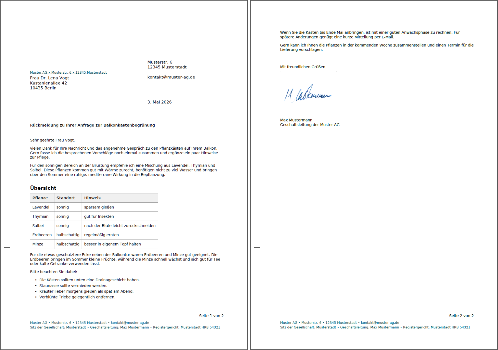

# briefutil

`briefutil` is a small Qt Quick desktop utility for turning short letters into
PDF files.

Letter layout, markdown body parsing, and PDF rendering are handled natively in
C++ with Qt 6 and libHaru.

<p align="center">
  
  <br>
  
</p>

## What it does

- lets you pick a sender profile from JSON files
- collects recipient, subject, and body text in a small desktop UI
- supports Markdown in the letter body
- generates DIN 5008 PDF letters
- can use either built-in PDF fonts or custom `.ttf` / `.otf` font files

The default sender profiles cover two letter styles:

- `simple`
- `commercial`

## Repository layout

```text
.
|- briefutil/              # Application, PDF core, tests, and CMake project
|- example.png             # README screenshot
|- sample_screenshot.png   # README screenshot
|- LICENSE.txt
\- README.md
```

The project root for the application code is [`briefutil/`](briefutil/).
That directory contains:

- the Qt Quick application
- the reusable `briefutil_core` C++ library target
- the markdown parser, layout engine, and libHaru renderer
- test executables used during development

## Requirements

- CMake 3.24 or newer
- a C++17 compiler
- Qt 6 with:
  - `Core`
  - `Gui`
  - `Qml`
  - `Quick`
  - `QuickControls2`
- network access on first configure, because CMake fetches:
  - `libHaru`
  - `zlib`
  - `libpng`

## Build

From the repository root:

```powershell
cmake -S briefutil -B briefutil/build -DCMAKE_PREFIX_PATH="C:/Qt/6.x/<toolchain>"
cmake --build briefutil/build --config Release
```

Adjust `CMAKE_PREFIX_PATH` to your local Qt installation, for example
`msvc2022_64` or `llvm-mingw_64`.

The main executable will be built as:

```text
briefutil/build/Release/briefutil.exe
```

## Run

After building:

```powershell
briefutil/build/Release/briefutil.exe
```

On Windows, the CMake build also runs Qt deployment steps so the build output
contains the required Qt DLLs, plugins, and QML modules.

## Runtime data

On first launch, the app creates and seeds:

```text
%USERPROFILE%/briefutil/templates/
```

This folder contains default sender profiles such as:

- `Max Mustermann.json`
- `Max Mustermann, Mustermann AG.json`
- `mustermann_signature.png`

Generated PDFs are written by default to:

```text
%USERPROFILE%/briefutil/output/
```

The app also stores UI and typography settings with `QSettings`, including:

- dark mode
- selected template directory
- font configuration
- body size and leading

An optional `output_dir.conf` file in the current working directory can
override the default output directory.

## Sender profiles

Sender profiles are JSON files loaded from the active template directory.

The important fields are:

- `id`
- `style`
- `sender_lines`
- `email`
- `return_address_line`
- `signer_name`
- `signature_image`

Commercial profiles can additionally define:

- `company_name`
- `company_name_color`
- `top_rule_color`
- `footer_lines`
- `signer_title`

The `signature_image` path is interpreted relative to the profile directory.

## Markdown support

The body field supports Markdown. The implemented subset includes:

- paragraphs
- bold
- italic
- headings
- bullet lists
- ordered lists
- images
- tables

Plain text without Markdown syntax also works.

## Font configuration

The settings window allows changing the fonts used for PDF generation.

There are two supported modes:

- built-in PDF base-14 font names for all configured faces
- `.ttf` / `.otf` file paths for all configured faces

Do not mix the two modes in one configuration. If you do, PDF generation is
rejected with an error.

The font configuration covers:

- sans regular
- sans bold
- sans italic
- sans bold italic
- monospace

## Development targets

The CMake project also defines a few development-only test executables:

- `test_renderer`
- `test_letter_builder`
- `test_markdown_parser`
- `test_md_to_pdf`

Typical examples:

```powershell
briefutil/build/Release/test_markdown_parser.exe
briefutil/build/Release/test_letter_builder.exe briefutil/build/Release/sample.pdf
briefutil/build/Release/test_md_to_pdf.exe briefutil/test_sample.md briefutil/build/Release/md.pdf
```

## Install / package

Install:

```powershell
cmake --install briefutil/build --config Release --prefix C:/apps/briefutil
```

Package:

```powershell
cpack -C Release --config briefutil/build/CPackConfig.cmake
```

The Windows packaging path is NSIS-based.

## License

Source code is provided under the Simplified BSD License. See
[`LICENSE.txt`](LICENSE.txt).
