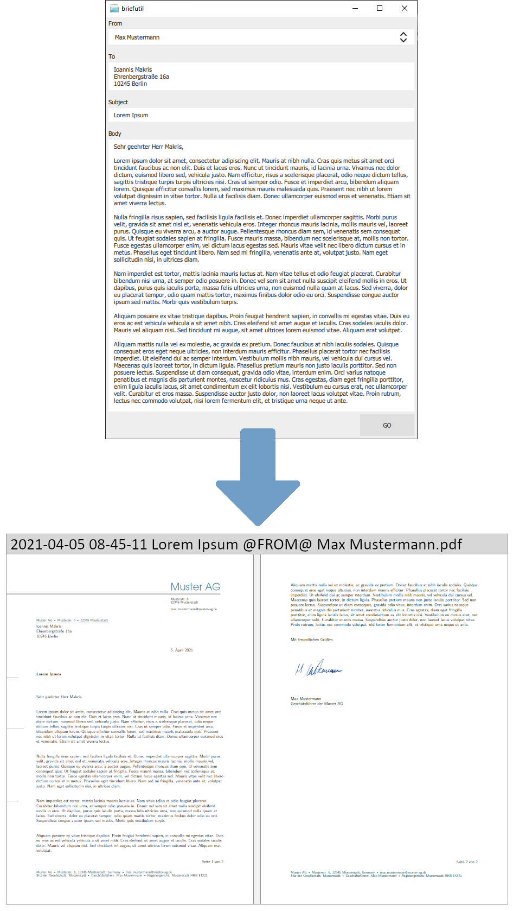

# briefutil

Small Qt Quick utility I use to turn ad-hoc letter text into a nicely formatted PDF via LaTeX. It grew out of personal needs and is still maintained with that mindset—if it helps someone else, fantastic, but it is not a polished, generally supported product.




The app drives MiKTeX’s `texify.exe` under the hood to compile LaTeX templates shipped with the program (placeholders featuring “Max Mustermann” data and a synthetic signature).

## Build Requirements
- CMake 3.16 or newer
- A C++17 compiler with `std::filesystem` support
- Qt 5.15+ or Qt 6 with the Core, Gui, Qml, and Quick modules available
- (Windows) PowerShell to expand archives

## Configure and Build
```bash
cmake -S . -B build -DCMAKE_PREFIX_PATH="C:/Qt/6.9.1/msvc2022_64"
cmake --build build --config Release
```
Adjust `CMAKE_PREFIX_PATH` to point at your local Qt installation. To bundle a portable MiKTeX runtime run (this downloads ~200 MB on first use):
```bash
cmake --build build --target portable_miktex --config Release
```
Skip that step or pass `-DBRIEFUTIL_BUNDLE_MIKTEX=OFF` if you prefer to rely on a system-wide MiKTeX installation.

To stage the runtime (Qt libraries + MiKTeX) into an install directory:
```bash
cmake --install build --config Release --prefix C:/apps/briefutil
```

To produce an NSIS installer with CPack:
```bash
cpack -C Release --config build/CPackConfig.cmake
```

## Runtime Notes
- On the first launch the executable creates `~/briefutil/templates/` and populates it with anonymised “Max Mustermann” examples plus a synthetic signature image. Replace those files with your own stationery as needed (the repository only ships neutral placeholder data).
- A matching output directory is picked up from `output_dir.conf` (UTF‑8 text file containing an absolute path). If the file is missing or invalid, the app falls back to `~/briefutil/output/`.
- `texify.exe` is resolved from the bundled portable MiKTeX tree (`<app>/miktex/texmfs/install/miktex/bin/x64/texify.exe`) first, and then from `PATH`. Keep MiKTeX up to date if you rely on the portable copy.
- Templates rely on standard LaTeX packages; adjust as you like, but remember the project is intentionally lightweight and tailored for a single user workflow.
